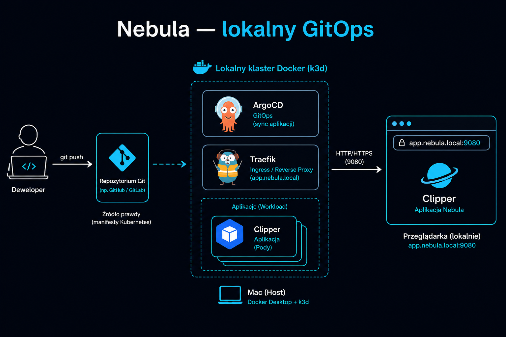
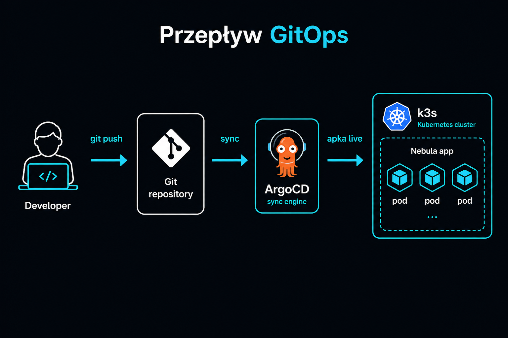
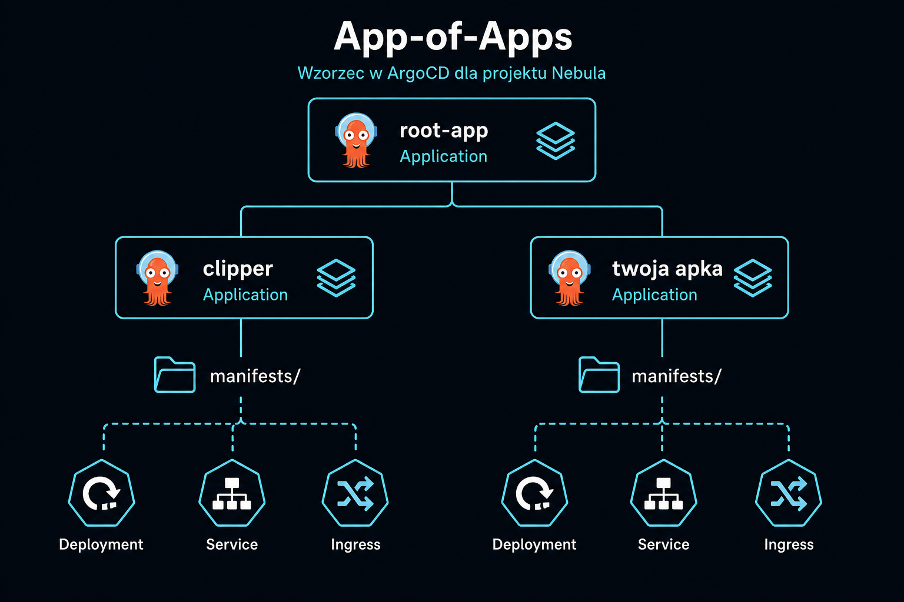
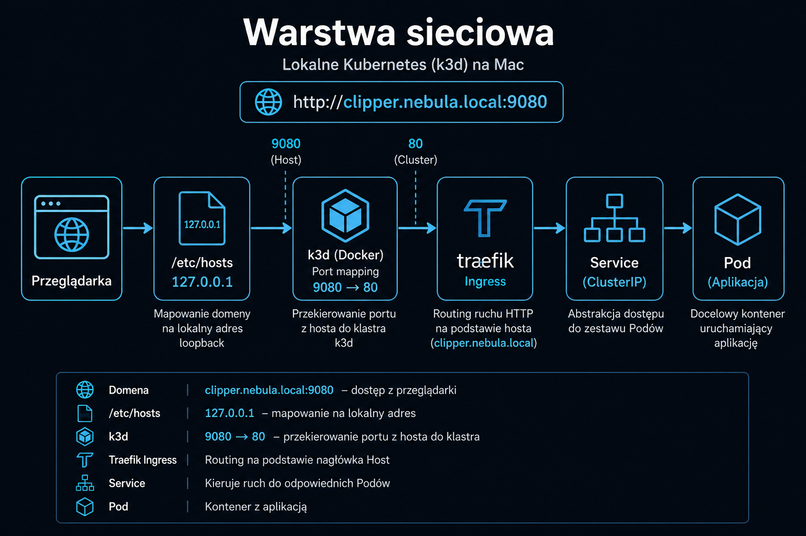
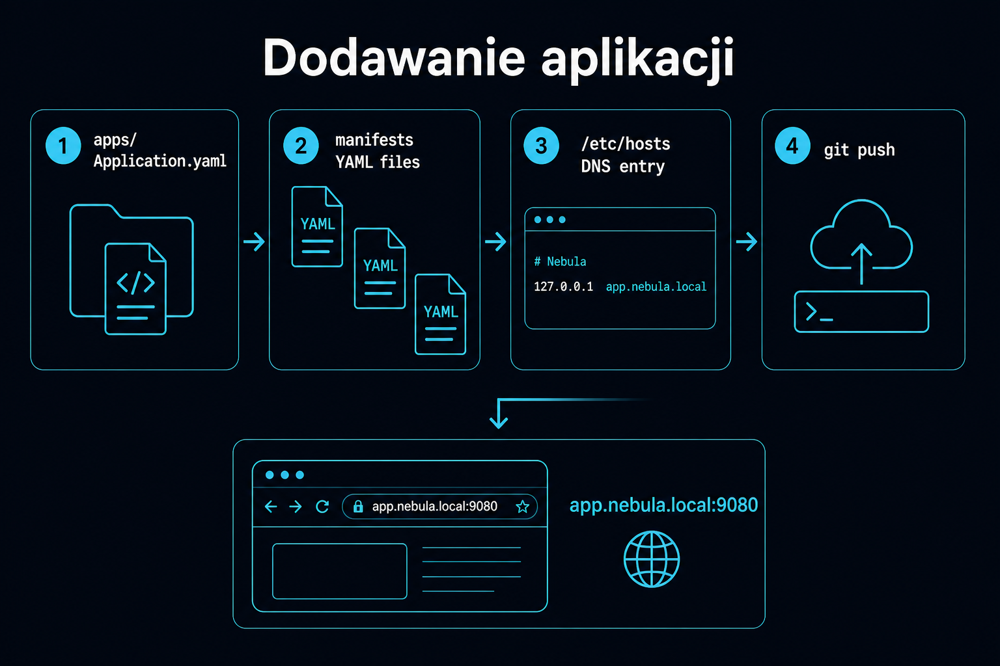
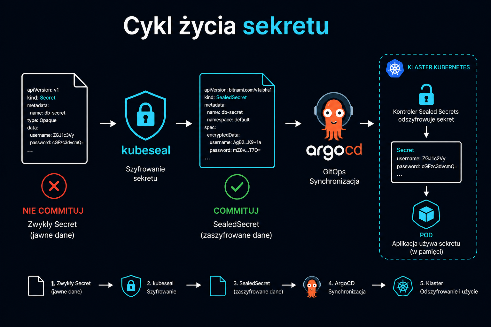
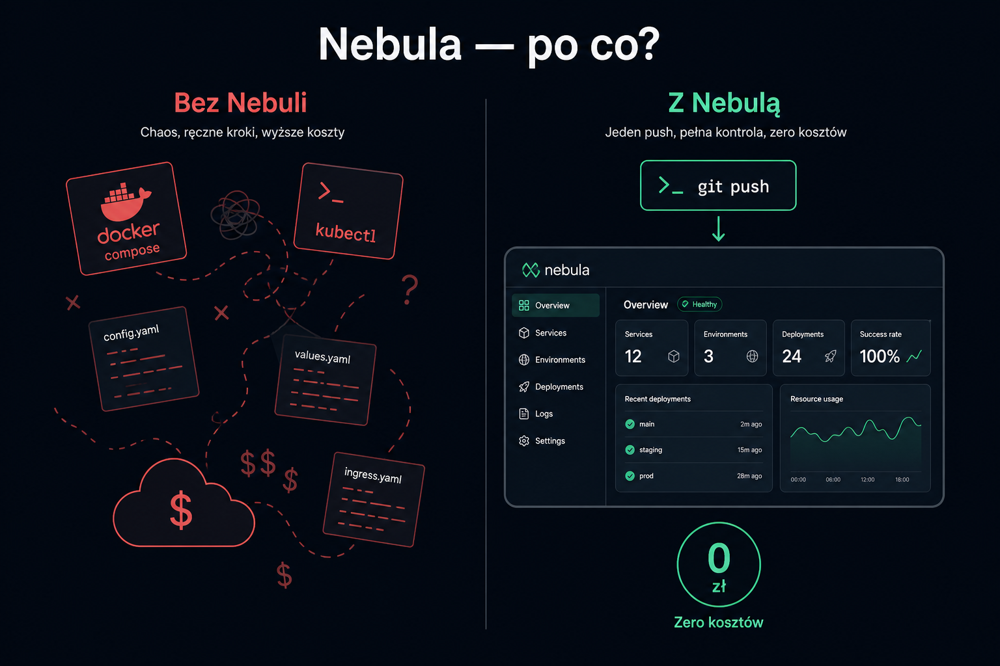

# Dokumentacja Nebula

Prosty przewodnik po lokalnym środowisku GitOps.

## Spis treści

1. **[Quickstart](quickstart.md)** — postaw środowisko od zera
2. **[Architektura](architecture.md)** — jak to działa (diagramy)
3. **[Dodawanie aplikacji](add-app.md)** — wdroż własny projekt
4. **[Troubleshooting](troubleshooting.md)** — gdy coś nie działa
5. **[Roadmap](roadmap.md)** — co dalej

## Dla kogo?

Dla developera, który chce:
- mieć **profesjonalne środowisko lokalne** bez płacenia za chmurę,
- wdrażać aplikacje przez **Git** zamiast ręcznych komend,
- uczyć się **Kubernetes i GitOps** na własnym sprzęcie.

Nebula **nie jest** produktem SaaS ani platformą enterprise.  
To darmowy, self-hosted zestaw narzędzi — Ty go uruchamiasz, Ty nim zarządzasz.

## Grafiki

| | Opis |
|---|---|
|  | Przegląd całego systemu |
|  | Przepływ wdrożenia |
|  | Wzorzec zarządzania aplikacjami |
|  | Routing HTTP lokalnie |
|  | Dodawanie aplikacji |
|  | Sealed Secrets |
|  | Bez vs z Nebulą |
