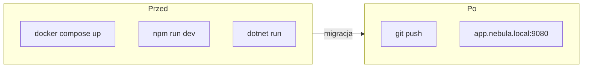
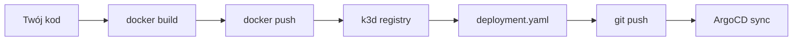

# Dodawanie aplikacji

Wdrożenie nowej apki w Nebuli to **4 pliki + 1 wpis DNS**.  
Clipper jest wzorcem — kopiujesz schemat, zmieniasz nazwy.


## Przed i po



---

## Krok 1 — Folder w `apps/`

Utwórz `apps/moja-apka/Application.yaml`:

```yaml
apiVersion: argoproj.io/v1alpha1
kind: Application
metadata:
  name: moja-apka
  namespace: argocd
spec:
  project: default
  source:
    repoURL: https://github.com/TWOJ-USER/Nebula.git
    targetRevision: HEAD
    path: manifests/moja-apka
  destination:
    server: https://kubernetes.default.svc
    namespace: moja-apka
  syncPolicy:
    automated:
      prune: true
      selfHeal: true
    syncOptions:
      - CreateNamespace=true
```

ArgoCD wykryje nowy folder automatycznie (dzięki `recurse: true` w root-app).

---

## Krok 2 — Manifesty w `manifests/`

Minimalny zestaw:

```
manifests/moja-apka/
├── namespace.yaml      ← opcjonalne (CreateNamespace=true też działa)
├── deployment.yaml
├── service.yaml
└── ingress.yaml
```

### deployment.yaml
```yaml
apiVersion: apps/v1
kind: Deployment
metadata:
  name: moja-apka
  namespace: moja-apka
spec:
  replicas: 1
  selector:
    matchLabels:
      app: moja-apka
  template:
    metadata:
      labels:
        app: moja-apka
    spec:
      containers:
        - name: app
          image: nginx:alpine          # na start publiczny obraz
          ports:
            - containerPort: 80
```

### service.yaml
```yaml
apiVersion: v1
kind: Service
metadata:
  name: moja-apka
  namespace: moja-apka
spec:
  selector:
    app: moja-apka
  ports:
    - port: 80
      targetPort: 80
```

### ingress.yaml
```yaml
apiVersion: networking.k8s.io/v1
kind: Ingress
metadata:
  name: moja-apka
  namespace: moja-apka
spec:
  ingressClassName: traefik
  rules:
    - host: moja-apka.nebula.local
      http:
        paths:
          - path: /
            pathType: Prefix
            backend:
              service:
                name: moja-apka
                port:
                  number: 80
```

---

## Krok 3 — DNS

```bash
sudo sh -c 'echo "127.0.0.1 moja-apka.nebula.local" >> /etc/hosts'
```

---

## Krok 4 — Deploy

```bash
git add apps/moja-apka manifests/moja-apka
git commit -m "feat: add moja-apka"
git push
```

Sprawdź sync w ArgoCD UI → http://localhost:9090

Test:
```bash
curl http://moja-apka.nebula.local:9080
```

---

## Własne obrazy Docker (registry k3d)

Gdy apka wymaga Twojego kodu (nie publicznego obrazu):

```bash
# Utwórz registry (jednorazowo)
k3d registry create nebula-registry --port 5050
k3d cluster edit nebula --registry-use k3d-nebula-registry:5050

# Build i push
docker build -t localhost:5050/moja-apka:v1 .
docker push localhost:5050/moja-apka:v1
```

W `deployment.yaml`:
```yaml
image: k3d-nebula-registry:5001/moja-apka:v1
```

> **Konwencja:** Taguj obrazy wersją (`v1`, git SHA) — unikaj `latest`.



---

## Checklist nowej apki

- [ ] `apps/<nazwa>/Application.yaml`
- [ ] `manifests/<nazwa>/deployment.yaml`
- [ ] `manifests/<nazwa>/service.yaml`
- [ ] `manifests/<nazwa>/ingress.yaml`
- [ ] Wpis w `/etc/hosts`
- [ ] `git push` + sync w ArgoCD
- [ ] `curl http://<nazwa>.nebula.local:9080`
