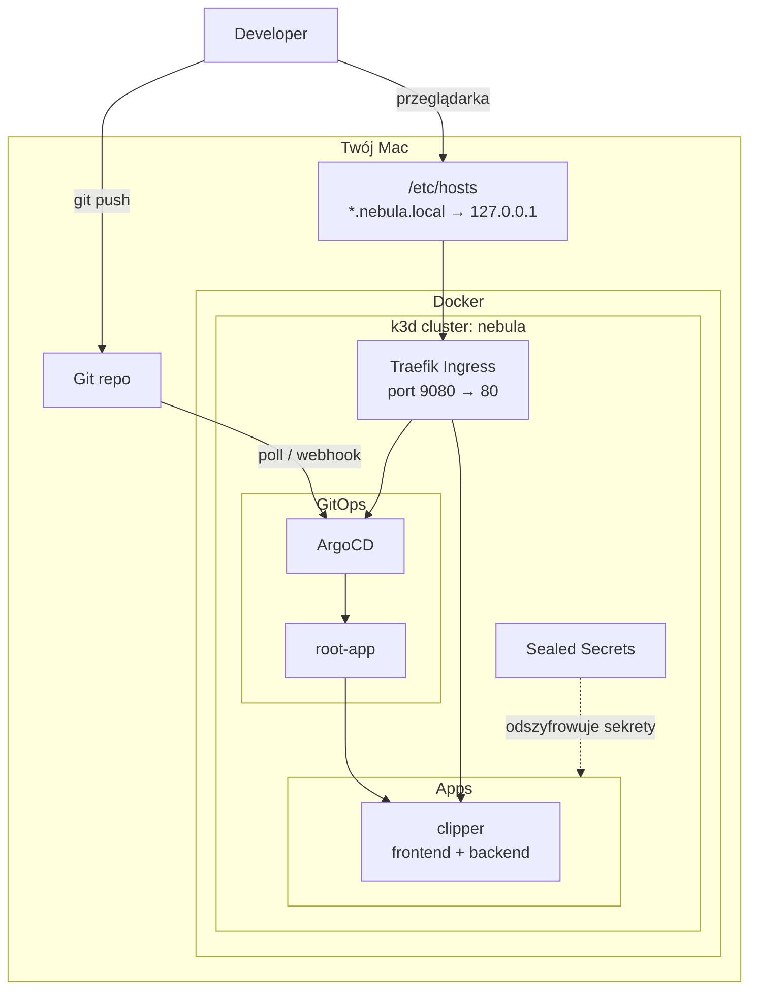
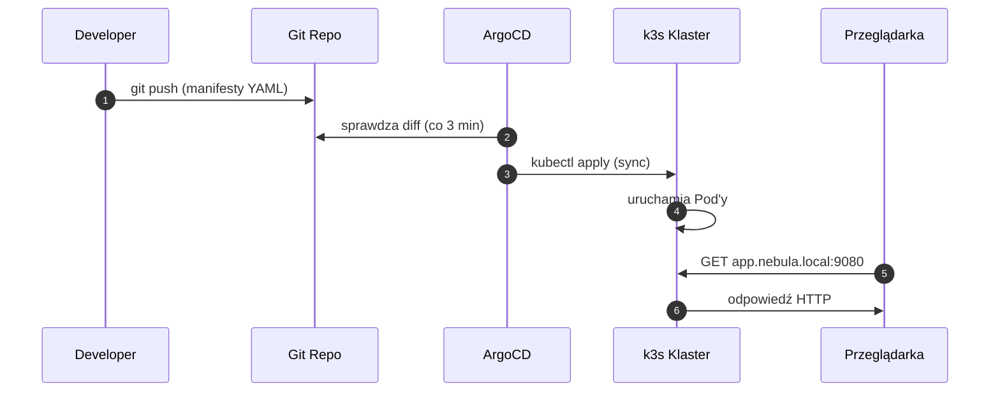
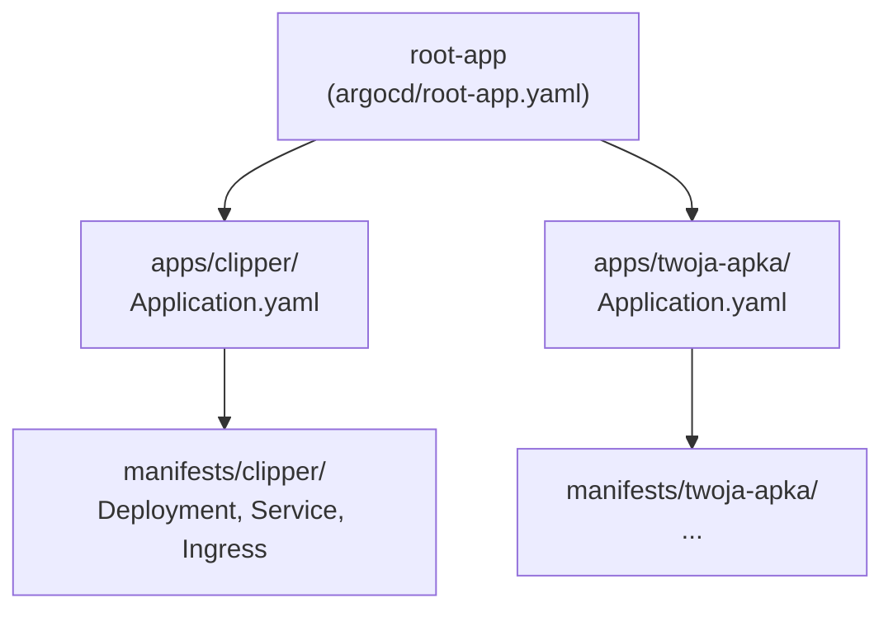
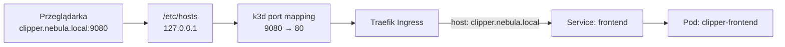
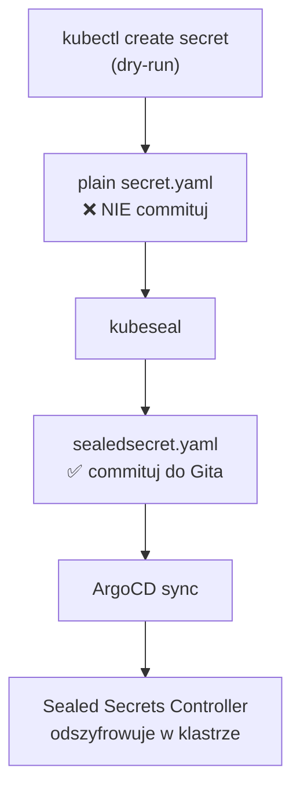
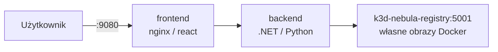

# Architektura

Nebula składa się z kilku warstw. Każda ma jedną, jasną rolę.


## Mapa komponentów



## Co robi każdy element?

| Komponent | Rola | Koszt |
|---|---|---|
| **k3d + k3s** | Lekki klaster Kubernetes w Dockerze | $0 |
| **Terraform** | Jednorazowy bootstrap (`make up`) | $0 |
| **ArgoCD** | GitOps — synchronizuje Git ↔ klaster | $0 |
| **Traefik** | Routing HTTP — każda apka pod własnym hostem | $0 (wbudowany w k3s) |
| **Sealed Secrets** | Szyfrowanie haseł w Gicie | $0 |

---

## Przepływ wdrożenia (GitOps)




**Single source of truth = Git.**  
Stan klastra zawsze odzwierciedla ostatni commit.

---

## App-of-Apps


Jeden `root-app` zarządza wszystkimi aplikacjami. Dodanie nowej apki = nowy folder w `apps/`.



Kluczowa opcja w `root-app.yaml`:
```yaml
directory:
  recurse: true   # ← ArgoCD skanuje podfoldery w apps/
```

---

## Struktura katalogów

```
Nebula/
├── docs/                    ← ta dokumentacja
├── terraform/               ← bootstrap (make up / make down)
│   ├── main.tf
│   ├── variables.tf
│   └── Makefile
├── argocd/
│   └── root-app.yaml        ← master Application
├── apps/                    ← definicje dla ArgoCD (lekkie YAML)
│   └── clipper/
│       └── Application.yaml
└── manifests/               ← pełne manifesty Kubernetes
    └── clipper/
        ├── namespace.yaml
        ├── frontend-deployment.yaml
        ├── frontend-service.yaml
        ├── backend-deployment.yaml
        ├── backend-service.yaml
        └── ingress.yaml
```

---

## Warstwa sieciowa


Port **9080** na hoście mapuje się na port **80** w klastrze (Traefik).



> **Uwaga:** Używamy portu 9080 zamiast 80, żeby uniknąć konfliktu z innymi serwisami na Macu.

---

## Cykl życia sekretu




Plain secret nigdy nie trafia do repozytorium. W Git jest tylko zaszyfrowana wersja.

---

## Clipper — przykładowa aplikacja

Clipper (łączenie PDF) pokazuje typowy układ: frontend + backend + lokalny registry.



Obrazy budujesz lokalnie, pushujesz do registry k3d, a w `deployment.yaml` wskazujesz tag obrazu.
