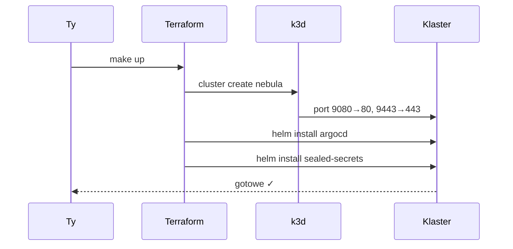
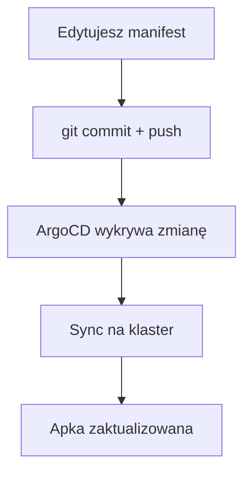

# Quickstart

Postaw Nebulę od zera w ~15 minut.


## Wymagania

| Narzędzie | Instalacja | Po co |
|---|---|---|
| Docker Desktop | [docker.com](https://www.docker.com/products/docker-desktop/) | Kontenery k3d |
| k3d | `brew install k3d` | Lokalny klaster Kubernetes |
| kubectl | `brew install kubectl` | Zarządzanie klastrem |
| Terraform | `brew install terraform` | Bootstrap infrastruktury |
| Helm | `brew install helm` | Instalacja ArgoCD |

Sprawdź wersje:
```bash
docker info && k3d version && kubectl version --client && terraform version
```

---

## Krok 1 — Bootstrap klastra

```bash
cd terraform
make up
```

To robi trzy rzeczy:
1. Tworzy klaster k3d o nazwie `nebula`
2. Instaluje ArgoCD (Helm)
3. Instaluje Sealed Secrets (Helm)

Po zakończeniu zobaczysz instrukcje logowania do ArgoCD.



---

## Krok 2 — DNS lokalny

Przeglądarka musi wiedzieć, że `*.nebula.local` to Twój Mac.

```bash
sudo sh -c 'echo "127.0.0.1 argocd.nebula.local clipper.nebula.local" >> /etc/hosts'
```

> **Tip:** Później możesz skonfigurować `dnsmasq` z wildcardem `*.nebula.local` — wtedy nie dodajesz wpisu przy każdej nowej apce. Zobacz [roadmap](roadmap.md).

---

## Krok 3 — ArgoCD UI

ArgoCD nie ma jeszcze Ingress z TLS — najprościej przez port-forward:

```bash
kubectl port-forward svc/argocd-server -n argocd 9090:80
```

Otwórz http://localhost:9090

| Pole | Wartość |
|---|---|
| Login | `admin` |
| Hasło | patrz poniżej |

```bash
kubectl -n argocd get secret argocd-initial-admin-secret \
  -o jsonpath='{.data.password}' | base64 -d && echo
```

W panelu powinieneś zobaczyć aplikację **root-app** i **clipper** (Synced / Healthy).

---

## Krok 4 — Sprawdź aplikację

```bash
curl -I http://clipper.nebula.local:9080
```

Otwórz w przeglądarce: http://clipper.nebula.local:9080

---

## Krok 5 — Podłącz Git (opcjonalnie)

Jeśli chcesz wdrażać przez `git push`:

1. Repo musi być dostępne dla ArgoCD (publiczne GitHub lub dodane credentials)
2. `root-app.yaml` wskazuje na `https://github.com/MikolajTanski/Nebula.git`
3. Zmiana w `manifests/` → commit → push → ArgoCD sync (~3 min lub natychmiast po refresh)



---

## Reset środowiska

```bash
cd terraform
make down    # usuwa klaster
make reboot  # pełny reset (down + up)
```

---

## Co dalej?

- [Dodaj własną aplikację](add-app.md)
- [Rozwiąż problemy](troubleshooting.md)
- [Zrozum architekturę](architecture.md)
