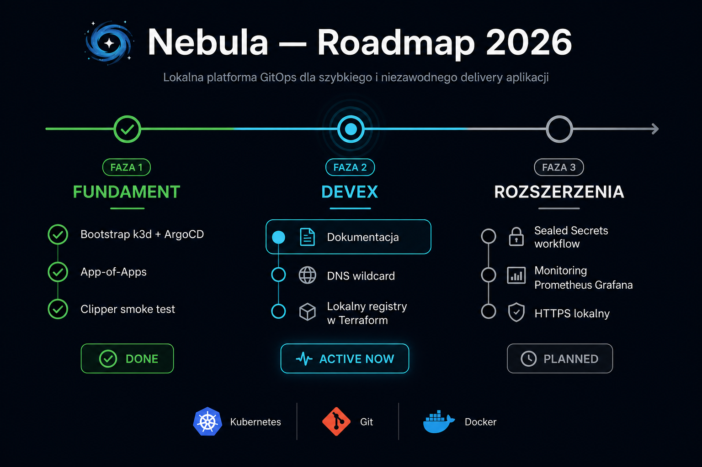
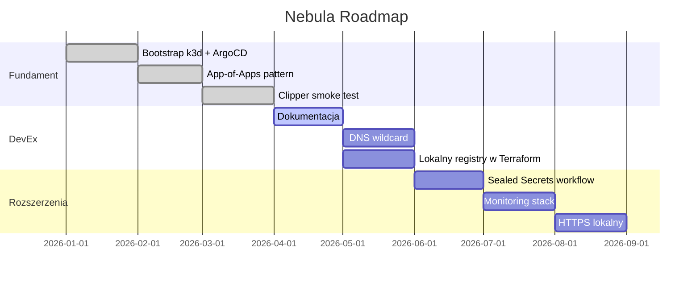

# Roadmap

Co jest gotowe, co planowane, co opcjonalne.



## Status

| Komponent | Status |
|---|---|
| k3d klaster `nebula` | ✅ działa |
| Terraform bootstrap | ✅ `make up` / `make down` |
| ArgoCD + root-app | ✅ App-of-Apps z `recurse: true` |
| Traefik Ingress | ✅ port 9080 |
| Sealed Secrets | ✅ zainstalowany |
| Clipper (przykładowa apka) | ✅ frontend + backend |
| Lokalny Docker registry | 🔶 ręczna konfiguracja |
| DNS wildcard (dnsmasq) | 📋 planowane |
| Monitoring (Prometheus/Grafana) | 📋 planowane |

---

## Fazy rozwoju



---

## Następne kroki (priorytet)

### 1. DNS wildcard
Zamiast ręcznego `/etc/hosts` przy każdej apce:
```bash
brew install dnsmasq
echo "address=/.nebula.local/127.0.0.1" >> /opt/homebrew/etc/dnsmasq.conf
sudo brew services start dnsmasq
```

### 2. Registry w Terraform
Automatyczne tworzenie `k3d-nebula-registry` przy `make up`.

### 3. Sealed Secrets — pełny workflow
Dokumentacja + przykład `sealedsecret.yaml` w Clipperze.

### 4. Monitoring
Prometheus + Grafana jako kolejna aplikacja w `apps/`.

---

## Backlog (nice to have)

| Pomysł | Opis |
|---|---|
| GitHub Actions lokalny | `act` — CI na Macu |
| Kubernetes Dashboard | Headlamp lub oficjalny dashboard |
| Multi-node k3d | 1 server + 2 agents |
| cert-manager | HTTPS z self-signed cert |
| Ollama + Open WebUI | Lokalne LLM w klastrze |
| Helm charts per app | Zamiast raw YAML |

---

## Filozofia produktu

Nebula to **darmowe narzędzie dev**, nie platforma enterprise.

- Proste > kompletne
- Działa lokalnie > skaluje się do chmury
- Dokumentacja > automatyzacja wszystkiego
- Open source > vendor lock-in

Każda funkcja musi zmniejszać tarcie, nie je zwiększać.
