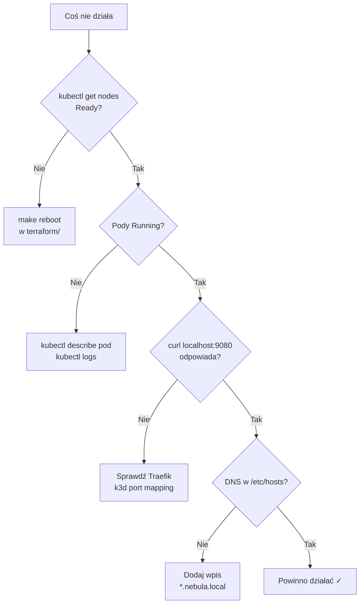

# Troubleshooting

Znane problemy i szybkie rozwiązania — zebrane z realnej pracy z Nebulą.


---

## Szybka diagnostyka

```bash
# Czy klaster działa?
kubectl get nodes

# Czy pody są healthy?
kubectl get pods -A

# Czy ArgoCD widzi aplikacje?
kubectl get applications -n argocd

# Czy Ingress odpowiada?
curl -I http://localhost:9080
```



---

## ArgoCD

### Nie widzę aplikacji w UI

**Przyczyna:** `root-app` nie został zaaplikowany lub brak `recurse: true`.

```bash
kubectl apply -f argocd/root-app.yaml
kubectl get applications -n argocd
```

Upewnij się, że w `root-app.yaml` jest:
```yaml
directory:
  recurse: true
```

### ArgoCD pokazuje OutOfSync / brak repo

**Przyczyna:** Repo prywatne lub ArgoCD nie ma dostępu.

Rozwiązania:
- Repo publiczne na GitHubie (najprostsze)
- Dodaj credentials w ArgoCD UI → Settings → Repositories
- Dla lokalnego dev: `kubectl apply -f manifests/` bezpośrednio (obejście)

### Hasło admina nie działa

```bash
# Pobierz aktualne hasło
kubectl -n argocd get secret argocd-initial-admin-secret \
  -o jsonpath='{.data.password}' | base64 -d && echo
```

Jeśli secret nie istnieje — ArgoCD mógł już zrotować hasło. Zresetuj:
```bash
kubectl -n argocd patch secret argocd-secret \
  -p '{"stringData":{"admin.password":"nowe-haslo","admin.passwordMtime":"'$(date +%FT%T%Z)'"}}'
```

---

## Sieć i DNS

### `clipper.nebula.local` nie odpowiada

**Checklist:**

1. Wpis w `/etc/hosts`:
   ```bash
   grep nebula /etc/hosts
   # powinno być: 127.0.0.1 clipper.nebula.local
   ```

2. Port **9080**, nie 80:
   ```
   http://clipper.nebula.local:9080   ← poprawnie
   http://clipper.nebula.local        ← nie zadziała
   ```

3. Klaster działa:
   ```bash
   k3d cluster list
   kubectl get ingress -A
   ```

### Port 9080 zajęty

Zmień w `terraform/variables.tf`:
```hcl
variable "port_http" {
  default = 9081   # inny wolny port
}
```
Potem `make reboot`.

### ArgoCD UI — port-forward vs Ingress

| Metoda | Adres | Kiedy używać |
|---|---|---|
| Port-forward | http://localhost:9090 | Zawsze działa, dev |
| Ingress | http://argocd.nebula.local:9080 | Wymaga wpisu w hosts |

Port-forward (najpewniejsze):
```bash
kubectl port-forward svc/argocd-server -n argocd 9090:80
```

---

## Docker i obrazy

### `ImagePullBackOff`

**Przyczyna:** Obraz nie istnieje w registry lub zła nazwa.

```bash
# Sprawdź jaki obraz oczekuje deployment
kubectl describe pod -n clipper -l app=frontend | grep Image

# Dla lokalnego registry — czy obraz jest?
docker images | grep clipper
```

Dla k3d registry obraz musi być pushnięty **przed** deployem:
```bash
docker build -t localhost:5050/clipper-frontend:v1 .
docker push localhost:5050/clipper-frontend:v1
```

W deployment używaj nazwy widocznej **z perspektywy klastra**:
```yaml
image: k3d-nebula-registry:5001/clipper-frontend:v1
```

### Registry nie działa po restarcie

```bash
k3d registry list
k3d cluster edit nebula --registry-use k3d-nebula-registry:5050
```

---

## Terraform / k3d

### `make up` kończy się błędem

**Klaster już istnieje:**
```bash
k3d cluster delete nebula
cd terraform && make up
```

**Docker nie działa:**
```bash
docker info   # musi odpowiedzieć bez błędu
```

**Stary stan Terraform:**
```bash
cd terraform
make down
make up
```

### Po reinstalacji Maca

```bash
brew install k3d terraform kubectl helm
cd terraform && make up
# dodaj /etc/hosts
# port-forward ArgoCD
```

Całe środowisko odtwarza się w ~5 minut.

---

## GitOps

### Zmiana w Git nie wdraża się

ArgoCD domyślnie polluje co **3 minuty**. Przyspiesz:
- ArgoCD UI → aplikacja → **Refresh** → **Sync**
- Lub włącz webhook (roadmap)

### Usunąłem aplikację z Git, ale nadal działa

Sprawdź `syncPolicy`:
```yaml
automated:
  prune: true    # ← musi być true, żeby usuwać zasoby
```

---

## Gdzie szukać logów

```bash
# Logi konkretnego poda
kubectl logs -n clipper -l app=frontend

# Eventy w namespace
kubectl get events -n clipper --sort-by='.lastTimestamp'

# Status ArgoCD aplikacji
kubectl describe application clipper -n argocd
```

---

## Nadal nie działa?

Pełny reset:
```bash
cd terraform
make down
make up
# /etc/hosts
# port-forward
# curl test
```

Jeśli problem powtarza się — otwórz issue na GitHubie z outputem:
```bash
kubectl get pods -A > debug.txt
kubectl get applications -n argocd >> debug.txt
kubectl describe application root-app -n argocd >> debug.txt
```
